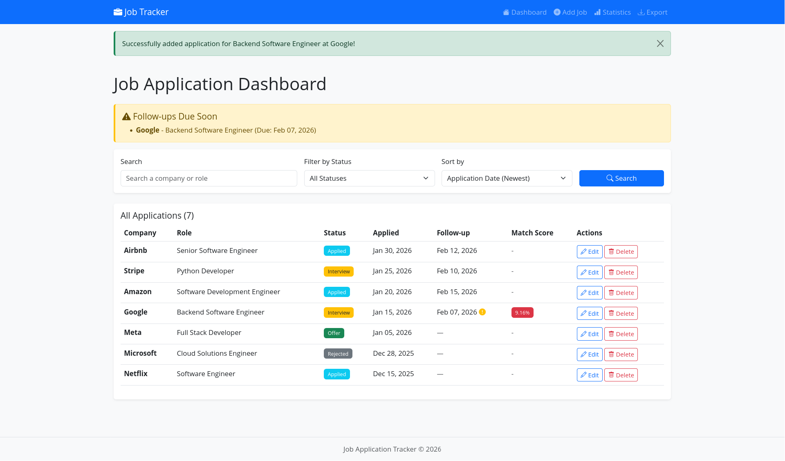
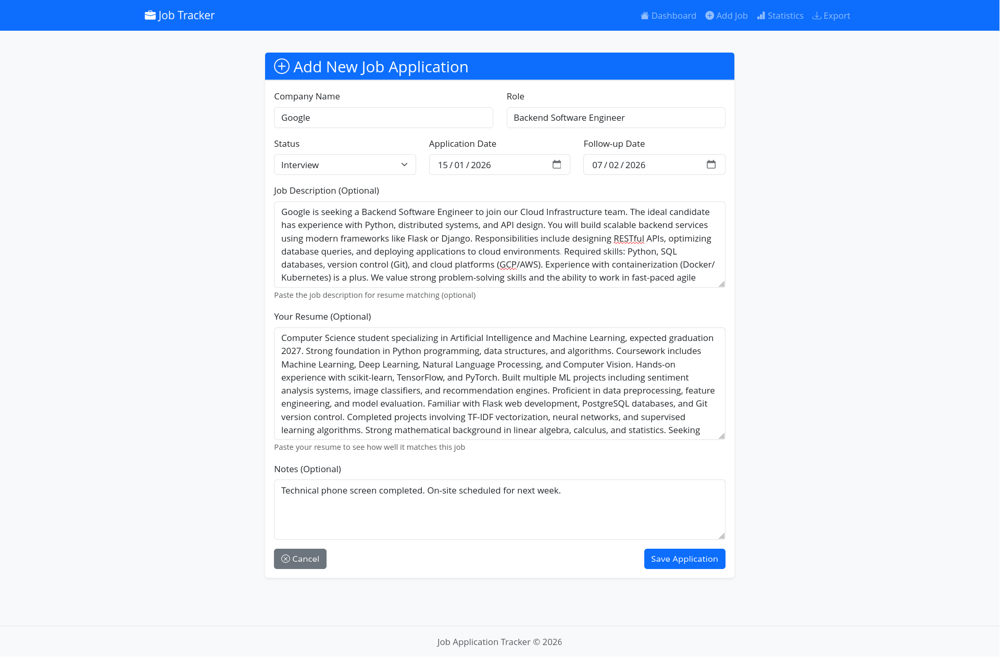
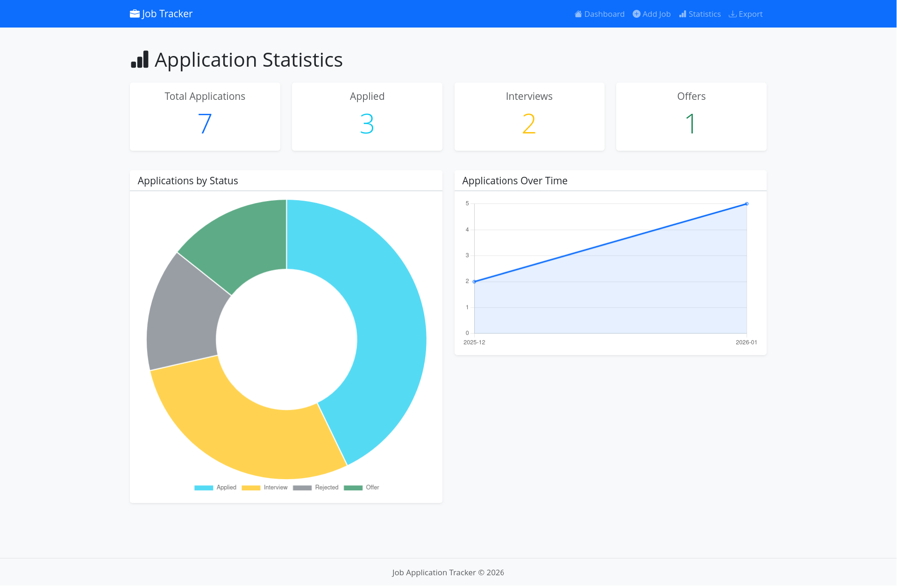

# Job Application Tracker


A Flask-based web application to manage job applications with intelligent resume matching and analytics.



---

## Live Demo
**[View Live Application](https://job-tracker-t8qn.onrender.com)**

---

## Features

### Core Functionality
- **Application Management**: Full CRUD operations for job applications
- **Smart Search & Filter**: Search by company or role, filter by status, and sort by date or company name
- **Follow-up Tracking**: Automatic alerts for applications needing follow-up within 3 days
- **AI-Powered Matching**: Resume-to-job description similarity scoring using the TF-IDF algorithm
- **Analytics Dashboard**: Visual statistics with interactive Chart.js graphs
- **Data Export**: Download all applications as CSV for backup or external analysis

### Application Tracking
- Track company name, job role, application status, dates, and notes
- Status options: Applied, Interview, Rejected, Offer
- Color-coded status badges for quick visual scanning
- Automatic timestamp tracking for all entries

### Resume Matching
- Paste your resume text to get AI-powered match scores
- TF-IDF vectorization with cosine similarity measurement
- Color-coded match scores:
  - Green: >70%
  - Yellow: 50–70%
  - Red: <50%
- Helps prioritize applications based on role fit

---

## Tech Stack

### Backend
- Flask 3.0 — Web framework
- SQLAlchemy — ORM for database operations
- WTForms — Form validation and rendering
- scikit-learn — Machine learning for text similarity

### Frontend
- Bootstrap 5 — Responsive UI framework
- Chart.js — Interactive data visualizations
- Jinja2 — Template engine

### Database
- SQLite — Development
- PostgreSQL — Production

### Deployment
- Render — Cloud hosting platform
- Gunicorn — WSGI HTTP server

---

## Screenshots

### Dashboard with Applications


*Main dashboard showing all applications with search, filter, and sort capabilities*

### Add Job Application


*Form to add new job applications with resume matching*

### Statistics & Analytics


*Visual analytics showing application breakdown and timeline*

---

## Installation

### Prerequisites
- Python 3.8+
- pip (Python package manager)

### Setup

1. **Clone the repository**
```bash
git clone https://github.com/yourusername/job-tracker.git
cd job-tracker
```

2. **Create and activate a virtual environment**
```bash
python -m venv venv

# macOS / Linux
source venv/bin/activate

# Windows
venv\Scripts\activate
```

3. **Install dependencies**
```bash
pip install -r requirements.txt
```

4. **Run the application**
```bash
python app.py
```

5. **Open in browser**
```
http://127.0.0.1:5000
# Or http://localhost:5000
```

---

## Usage

### Adding an Application

1. Click "Add Job" in the navigation bar
2. Fill in company name, role, status, and dates
3. Optionally paste job description and resume text for match scoring
4. Add any notes about the application
5. Click "Save Application"

### Search and Filters

- **Search**: Filter by company name or role
- **Filter by Status**: Select a specific status from the dropdown
- **Sort**: Order results by date or company name

### Follow-up Tracking

- Set a follow-up date while adding or editing applications
- Dashboard displays alerts for follow-ups due within 3 days
- Visual indicators highlight upcoming follow-ups

### Analytics

- Navigate to the Statistics page
- View total applications and status breakdown
- Timeline chart displays application trends over time

### Exporting Data

- Click "Export" to download all applications as a CSV file
- Useful for backups or external analysis

---

## Technical Implementation

### Machine Learning

The resume matching feature uses TF-IDF (Term Frequency–Inverse Document Frequency) vectorization to convert text into numerical vectors. Cosine similarity is then calculated between the resume and job description to produce a match percentage.

### Database Schema

Single-table design using SQLAlchemy ORM:

- Company name, role, and status
- Application and follow-up dates
- Resume text and job description
- Match score and notes

### Error Handling

Custom 404 error page with navigation back to the dashboard.

---

## Project Structure

```
job-tracker/
├── app.py              # Main Flask application
├── models.py           # Database models
├── forms.py            # WTForms definitions
├── requirements.txt    # Python dependencies
├── templates/          # HTML templates
│   ├── base.html
│   ├── index.html
│   ├── add_job.html
│   ├── edit_job.html
│   ├── stats.html
│   └── 404.html
├── static/             # CSS and static assets
│   └── style.css
└── instance/           # Database files (gitignored)
```

---

## Learning Outcomes

This project demonstrates:

- Full-stack web development using Flask
- Database design and ORM usage with SQLAlchemy
- NLP-based similarity scoring using scikit-learn
- RESTful routing and request handling
- Template inheritance and dynamic rendering
- Form validation and user input handling
- Data visualization with Chart.js
- Production deployment on cloud platforms
- Responsive UI design with Bootstrap

---

## Future Enhancements

- Email notifications for upcoming follow-ups
- Multiple resume profile support
- Company research integration
- Interview preparation notes and checklists
- Application deadline reminders
- Dark mode theme

---

## License

This project is licensed under the MIT License.

---

## Author

**Your Name**
- GitHub: [@chandanxd](https://github.com/chandanxd)
- LinkedIn: [Chandan D](https://linkedin.com/in/chandanxd)

---

## Acknowledgments

Built with Flask, Bootstrap, Chart.js, and scikit-learn.
